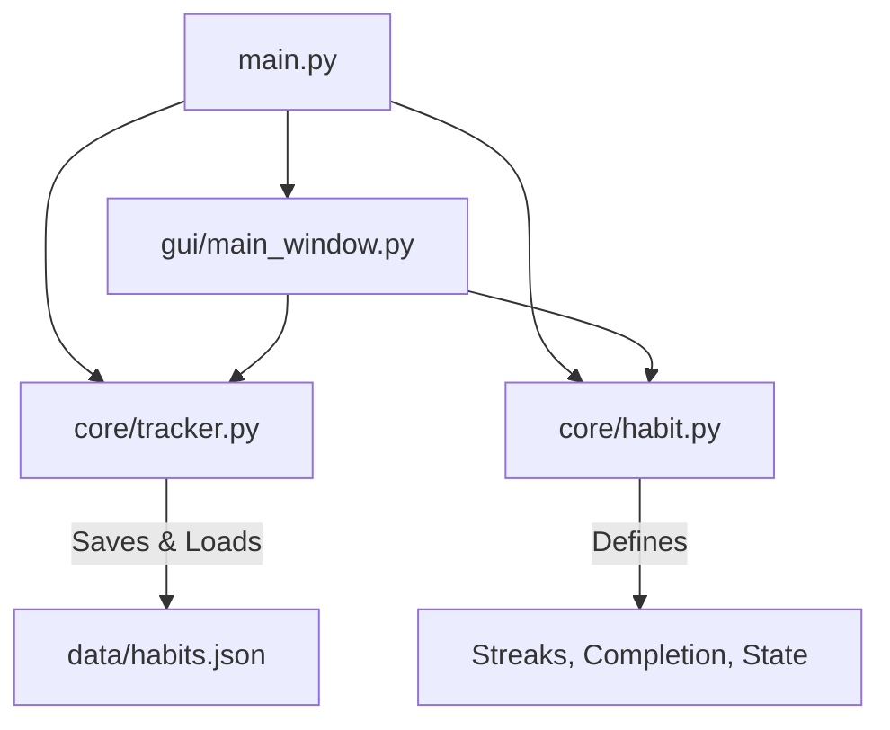

```mermaid
flowchart TD
  Main[main.py] --> GUI[gui/main_window.py]
  Main --> Tracker[core/tracker.py]
  Main --> Habit[core/habit.py]

  GUI --> Tracker
  GUI --> Habit

  Tracker -->|Saves & Loads| JSON["data/habits.json"]
  Habit -->|Defines| Logic[Streaks, Completion, State]
```
