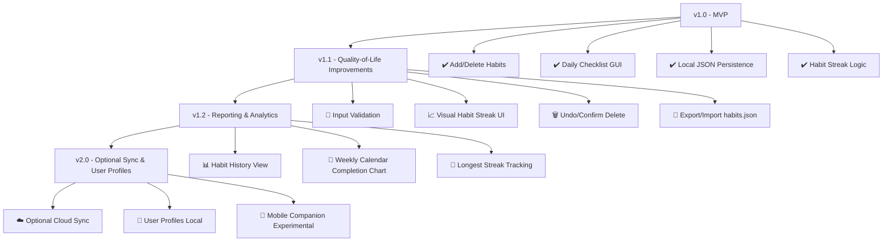

```mermaid
graph TD
  A[v1.0 - MVP] --> B[v1.1 - Quality-of-Life Improvements]
  B --> C[v1.2 - Reporting & Analytics]
  C --> D[v2.0 - Optional Sync & User Profiles]

  A --> A1[✔️ Add/Delete Habits]
  A --> A2[✔️ Daily Checklist GUI]
  A --> A3[✔️ Local JSON Persistence]
  A --> A4[✔️ Habit Streak Logic]

  B --> B1[🧹 Input Validation]
  B --> B2[📈 Visual Habit Streak UI]
  B --> B3[🗑 Undo/Confirm Delete]
  B --> B4[💾 Export/Import habits.json]

  C --> C1[📊 Habit History View]
  C --> C2[📅 Weekly Calendar Completion Chart]
  C --> C3[🧠 Longest Streak Tracking]

  D --> D1[☁️ Optional Cloud Sync]
  D --> D2[🔐 User Profiles Local]
  D --> D3[📲 Mobile Companion Experimental]
```
