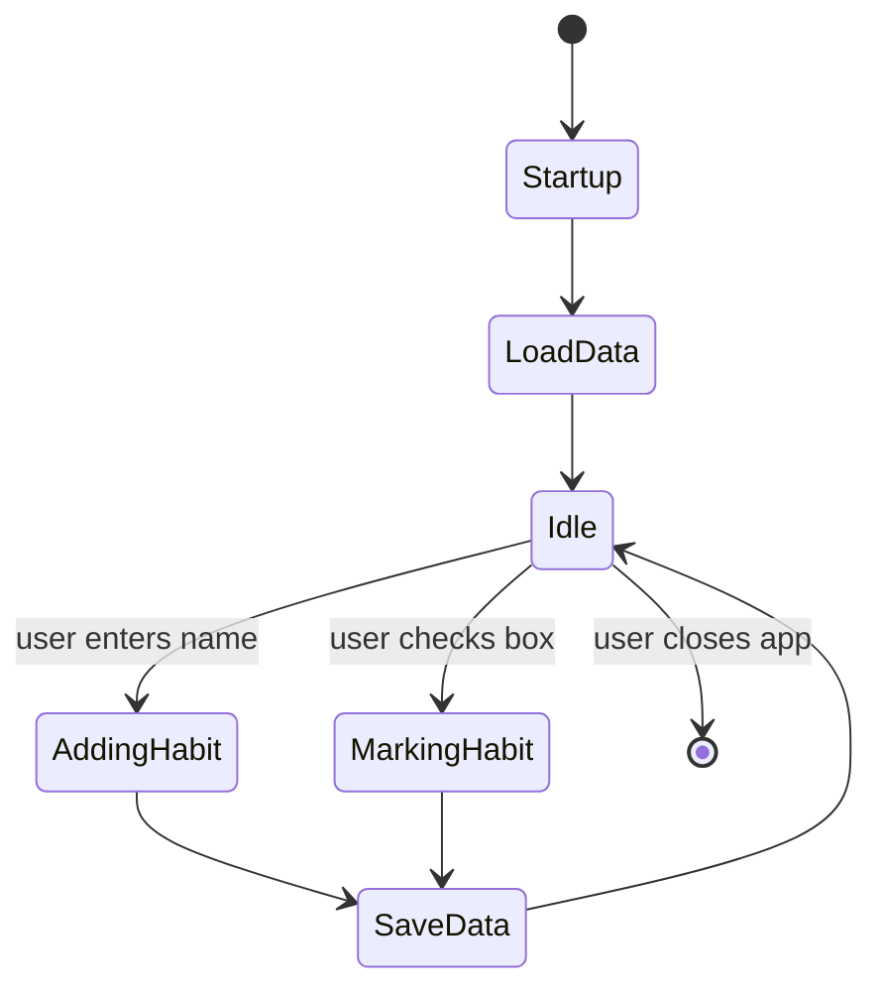

```mermaid
stateDiagram-v2
  [*] --> Startup
  Startup --> LoadData
  LoadData --> Idle
  Idle --> AddingHabit : user enters name
  Idle --> MarkingHabit : user checks box
  AddingHabit --> SaveData
  MarkingHabit --> SaveData
  SaveData --> Idle
  Idle --> [*] : user closes app
```
