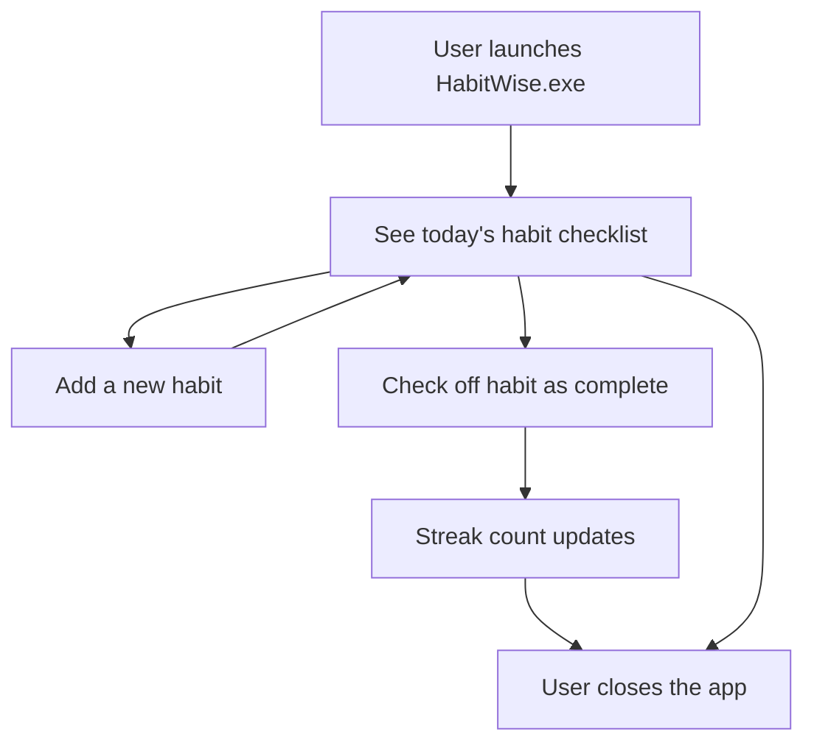

```mermaid
graph TD
  Launch["User launches HabitWise.exe"]
  ViewList["See today's habit checklist"]
  AddHabit["Add a new habit"]
  MarkHabit["Check off habit as complete"]
  SeeStreak["Streak count updates"]
  Exit["User closes the app"]

  Launch --> ViewList
  ViewList --> AddHabit
  ViewList --> MarkHabit
  MarkHabit --> SeeStreak
  AddHabit --> ViewList
  SeeStreak --> Exit
  ViewList --> Exit
```
